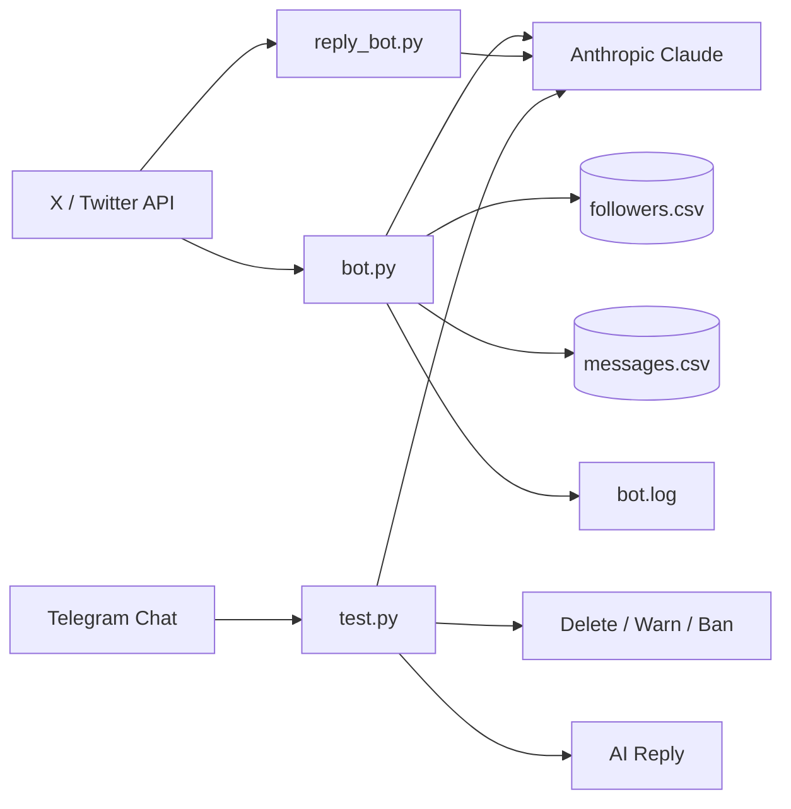

<div align="center">

# 🤖 Dark Pino AI Social Bot

**AI-powered automation for X/Twitter engagement and Telegram community moderation.**

[](https://www.python.org/)
[](https://developer.x.com/)
[](https://www.anthropic.com/)
[](https://core.telegram.org/bots/api)
[](#license)

[Features](#-features) • [Architecture](#-architecture) • [Quick Start](#-quick-start) • [Usage](#-usage) • [Configuration](#-configuration) • [Safety](#-security--safety)

</div>

---

## ✨ Overview

Dark Pino AI Social Bot is a Python project for automating selected community-management tasks across **X/Twitter** and **Telegram**.

It can detect new X followers, follow them back, send AI-generated welcome DMs, respond to incoming direct messages, and moderate a Telegram community by classifying messages as spam, project questions, or normal conversation.

> [!IMPORTANT]
> Use automation responsibly and make sure your X/Twitter and Telegram usage complies with each platform's current API terms, rate limits, and automation rules.

## 🚀 Features

| Area | Capability |
|---|---|
| X follower automation | Detects followers, follows back new users, and tracks processed IDs |
| Welcome DMs | Generates short Claude-powered welcome messages for new followers |
| X DM assistant | Reads incoming DMs and creates project-aware AI replies |
| DM streaming | Includes a separate listener for real-time-style DM event handling |
| Telegram moderation | Classifies chat messages as `SPAM`, `QUESTION`, or `NORMAL` |
| Spam handling | Deletes detected spam, warns users, and can ban repeat offenders |
| AI answers | Uses Anthropic Claude to answer project questions in natural language |
| Rate control | Includes configurable hourly limits and randomized delays |
| Persistence | Stores processed follower/message IDs in local CSV files |
| Logging | Writes runtime activity and errors to `bot.log` |
| Secret management | Loads API credentials from environment variables instead of source code |

## 🧭 Architecture



<details>
<summary><strong>📁 Project structure</strong></summary>

```text
twiiter-bot-main/
├── .env.example       # Safe template for environment variables
├── .gitignore         # Prevents secrets, logs, CSV data, etc. from being committed
├── README.md          # Project documentation
├── requirements.txt   # Python dependencies
├── bot.py             # X follower + DM automation loop
├── reply_bot.py       # X DM stream listener + AI replies
└── test.py            # Telegram moderation + AI question answering
```

Runtime-generated files such as `followers.csv`, `messages.csv`, and `bot.log` are intentionally ignored by Git.

</details>

## ⚡ Quick Start

### 1. Clone the repository

```bash
git clone <your-repository-url>
cd twiiter-bot-main
```

### 2. Create a virtual environment

**Windows**

```bash
python -m venv .venv
.venv\Scripts\activate
```

**macOS / Linux**

```bash
python3 -m venv .venv
source .venv/bin/activate
```

### 3. Install dependencies

```bash
pip install -r requirements.txt
```

### 4. Create your environment file

Copy the included template:

```bash
cp .env.example .env
```

On Windows PowerShell:

```powershell
Copy-Item .env.example .env
```

Then replace the placeholder values in `.env` with your own credentials.

### 5. Run the component you need

```bash
python bot.py
```

or

```bash
python reply_bot.py
```

or

```bash
python test.py
```

## 🔐 Configuration

Create a `.env` file in the project root. The repository includes `.env.example` as a safe starting point.

| Variable | Used for | Required by |
|---|---|---|
| `X_USER_ID` | Your X/Twitter user ID | `bot.py`, `reply_bot.py` |
| `CONSUMER_KEY` | X/Twitter API consumer key | `bot.py`, `reply_bot.py` |
| `CONSUMER_SECRET` | X/Twitter API consumer secret | `bot.py`, `reply_bot.py` |
| `ACCESS_TOKEN` | X/Twitter access token | `bot.py`, `reply_bot.py` |
| `ACCESS_SECRET` | X/Twitter access-token secret | `bot.py`, `reply_bot.py` |
| `CLAUDE_API_KEY` | Anthropic API key | All bot scripts |
| `COIN_NAME` | Project/token display name | `bot.py` |
| `WEBSITE` | Official project website | `bot.py` |
| `BLOCKCHAIN` | Blockchain/network name | `bot.py` |
| `TELEGRAM_TOKEN` | Telegram bot token | `test.py` |

<details>
<summary><strong>🧪 Example .env format</strong></summary>

```env
X_USER_ID=1234567890
CONSUMER_KEY=your_consumer_key
CONSUMER_SECRET=your_consumer_secret
ACCESS_TOKEN=your_access_token
ACCESS_SECRET=your_access_secret
CLAUDE_API_KEY=your_anthropic_api_key

COIN_NAME=Dark Pino
WEBSITE=https://darkpino.xyz/
BLOCKCHAIN=Solana

TELEGRAM_TOKEN=your_telegram_bot_token
```

</details>

> [!CAUTION]
> Never commit `.env`, API keys, access tokens, private keys, wallet files, seed phrases, or credentials to GitHub. The included `.gitignore` excludes common secret files.

## ▶️ Usage

### `bot.py` — follower + DM automation

Runs a continuous loop that:

1. Fetches followers from X.
2. Skips users already stored in `followers.csv`.
3. Follows back new followers within the configured hourly limit.
4. Generates and sends a short Claude-powered welcome DM.
5. Reads DM events and replies to unprocessed messages.
6. Stores processed DM IDs in `messages.csv`.
7. Writes status/error information to `bot.log`.

Run it with:

```bash
python bot.py
```

<details>
<summary><strong>⚙️ Default safety limits in bot.py</strong></summary>

```python
MAX_DMS_PER_HOUR = 12
MAX_FOLLOWS_PER_HOUR = 15
MIN_DELAY = 30
MAX_DELAY = 75
```

These are application-level limits only. They do **not** replace official platform rate limits or policy requirements.

</details>

### `reply_bot.py` — DM stream assistant

Connects to the X DM event stream, ignores messages sent by the bot account itself, sends incoming user text to Claude, and posts the generated response back by DM.

```bash
python reply_bot.py
```

### `test.py` — Telegram AI moderator

Classifies each text message into one of three categories:

```text
SPAM
QUESTION
NORMAL
```

Behavior:

- `SPAM` → delete the message, warn the user, and ban after repeated detections.
- `QUESTION` → generate a project-aware Claude response.
- `NORMAL` → leave the message untouched.

Run it with:

```bash
python test.py
```

> [!NOTE]
> For message deletion and member bans, the Telegram bot must have the appropriate administrator permissions in the target group.

## 🧠 AI Behavior

The prompts are designed to keep replies concise and community-focused. In the main X bot, the AI is instructed not to provide financial advice or price predictions.

You can customize the prompts inside:

- `generate_welcome()` and `generate_coin_reply()` in `bot.py`
- `generate_reply()` in `reply_bot.py`
- `classify_message()` and `generate_reply()` in `test.py`

## 🛡️ Security & Safety

- Keep all credentials in `.env`.
- Do not commit runtime CSV files or logs if they contain user identifiers.
- Rotate any key immediately if it has ever been exposed publicly.
- Review X/Twitter and Telegram automation policies before production use.
- Test with a private/dev account or test group before enabling automated actions at scale.
- Treat AI output as generated content and add additional validation where your use case requires it.

## 🧰 Troubleshooting

<details>
<summary><strong>Authentication fails</strong></summary>

Check that all X/Twitter credentials are present in `.env`, that they belong to the same developer application/account, and that the app has the permissions needed for following and direct messages.

</details>

<details>
<summary><strong>Claude requests fail</strong></summary>

Verify `CLAUDE_API_KEY`, your Anthropic account access, the configured model name, and your API usage limits.

</details>

<details>
<summary><strong>Telegram bot does not delete or ban users</strong></summary>

Make the bot an administrator in the group and grant the permissions needed to delete messages and restrict/ban members.

</details>

<details>
<summary><strong>The bot keeps reprocessing users or messages</strong></summary>

Make sure the application can create and write `followers.csv` and `messages.csv` in its working directory. Deleting those files resets the local processed-ID history.

</details>

## 🗺️ Suggested Roadmap

- [ ] Move rate limits and delays into environment/config settings
- [ ] Add structured retry/backoff for API `429` and transient `5xx` errors
- [ ] Add tests for prompt generation and API response handling
- [ ] Replace local CSV state with SQLite or another persistent store for production
- [ ] Add Docker support
- [ ] Add configurable moderation thresholds and warning persistence
- [ ] Add health checks and deployment documentation

## 🤝 Contributing

Contributions are welcome. A simple workflow is:

1. Fork the repository.
2. Create a feature branch.
3. Make and test your changes.
4. Open a pull request with a clear description.

## 📄 License

No license is currently included in this repository. Add a license file before distributing the project if you want to define how others may use, modify, or redistribute the code.

---

<div align="center">

Built with Python, X/Twitter APIs, Telegram, and Anthropic Claude.

</div>
